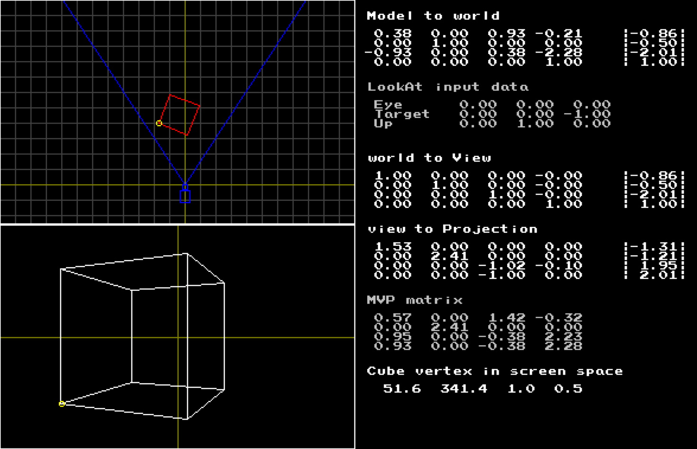
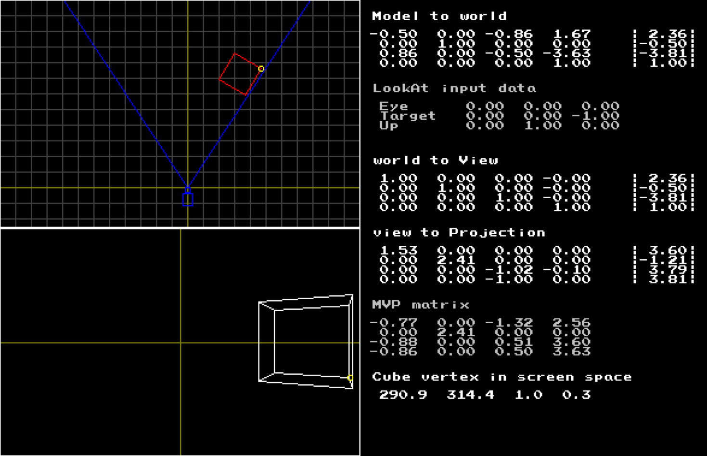

# 3DDemo
Small program visually demonstrating some basics of linear algebra.

  
  &nbsp;

The project is built on [tPixelGameEngine](https://github.com/tucna/tPixelGameEngine) which is only one dependency used exclusively for pixel drawing.

# Controls
- `W/A/S/D` - move the cube.
- `Q/E` - rotate the cube.

# Features
- 2D and 3D preview of the scene.
- Fixed camera with frustum preview.
- All matrices used for all steps needed for rendering are printed out.
- Cohen-Sutherland line clipping.
